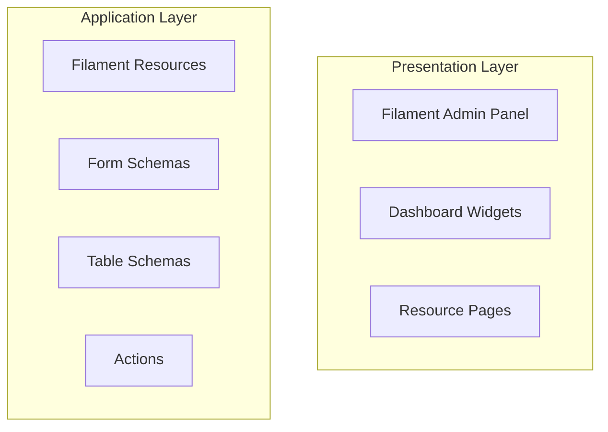
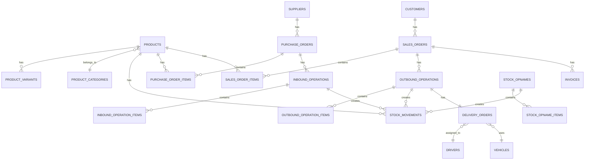

# Design Document

## Overview

This document outlines the technical design for a Warehouse Management System (WMS) built with Laravel 12 and Filament 4. The system follows a modular architecture with clear separation of concerns, utilizing Laravel's Eloquent ORM for data management and Filament's admin panel components for the user interface.

### Technology Stack

- **Backend Framework**: Laravel 12
- **Admin Panel**: Filament 4
- **Database**: MySQL/PostgreSQL (configurable)
- **Authentication**: Laravel Breeze/Sanctum
- **Authorization**: Spatie Laravel Permission
- **PDF Generation**: Laravel DomPDF
- **Queue System**: Laravel Queue (Redis/Database driver)

### Key Design Principles

1. **Stock Movement Pattern**: All inventory changes are recorded as movements rather than direct updates to stock quantities
2. **Event Sourcing for Inventory**: Stock quantities are calculated from the sum of all movements
3. **Role-Based Access Control**: Strict permission system using Spatie Laravel Permission
4. **Audit Trail**: Complete traceability of all transactions
5. **Modular Architecture**: Separation of concerns with dedicated schema classes for forms and tables

## Architecture

### System Architecture Diagram



    subgraph "Business Logic Layer"
        H[Services]
        I[Stock Movement Service]
        J[Document Generation Service]
        K[Report Service]
    end

    subgraph "Data Layer"
        L[Eloquent Models]
        M[Repositories]
        N[Database]
    end

    A --> D
    D --> E
    D --> F
    D --> G
    E --> H
    F --> H
    G --> H
    H --> L
    L --> N
    B --> K
    K --> L

```

### Directory Structure

```

app/
├── Filament/
│ ├── Resources/
│ │ ├── Products/
│ │ │ ├── ProductResource.php
│ │ │ ├── Schemas/
│ │ │ │ ├── ProductForm.php
│ │ │ │ └── ProductTable.php
│ │ │ └── Pages/
│ │ ├── Customers/
│ │ ├── Suppliers/
│ │ ├── PurchaseOrders/
│ │ ├── SalesOrders/
│ │ ├── InboundOperations/
│ │ ├── OutboundOperations/
│ │ ├── StockOpnames/
│ │ ├── DeliveryOrders/
│ │ └── Invoices/
│ ├── Widgets/
│ │ ├── StatsOverview.php
│ │ ├── SalesChart.php
│ │ ├── TopProductsTable.php
│ │ └── LowStockTable.php
│ └── Pages/
│ ├── Dashboard.php
│ └── Reports/
│ ├── StockCardReport.php
│ ├── LowStockReport.php
│ ├── StockValuationReport.php
│ ├── SalesReport.php
│ └── PurchaseReport.php
├── Models/
│ ├── Product.php
│ ├── ProductCategory.php
│ ├── ProductVariant.php
│ ├── Customer.php
│ ├── Supplier.php
│ ├── Driver.php
│ ├── Vehicle.php
│ ├── PurchaseOrder.php
│ ├── PurchaseOrderItem.php
│ ├── SalesOrder.php
│ ├── SalesOrderItem.php
│ ├── InboundOperation.php
│ ├── InboundOperationItem.php
│ ├── OutboundOperation.php
│ ├── OutboundOperationItem.php
│ ├── StockMovement.php
│ ├── StockOpname.php
│ ├── StockOpnameItem.php
│ ├── DeliveryOrder.php
│ └── Invoice.php
├── Services/
│ ├── StockMovementService.php
│ ├── DocumentGenerationService.php
│ └── ReportService.php
└── Enums/
├── PurchaseOrderStatus.php
├── SalesOrderStatus.php
├── StockMovementType.php
└── InvoiceStatus.php

```

## Components and Interfaces

### Core Models and Relationships
```

#### Product Model

```php
class Product extends Model
{
    protected $fillable = [
        'sku', 'name', 'description', 'unit',
        'purchase_price', 'selling_price',
        'category_id', 'minimum_stock', 'rack_location'
    ];

    // Relationships
    public function category(): BelongsTo
    public function variants(): HasMany
    public function stockMovements(): HasMany
    public function purchaseOrderItems(): HasMany
    public function salesOrderItems(): HasMany

    // Computed Properties
    public function getCurrentStock(): int
    public function getStockValue(): float
    public function isLowStock(): bool
}
```

#### Stock Movement Model (Critical)

```php
class StockMovement extends Model
{
    protected $fillable = [
        'product_id', 'quantity', 'type',
        'reference_type', 'reference_id',
        'notes', 'created_by'
    ];

    protected $casts = [
        'type' => StockMovementType::class,
        'quantity' => 'integer'
    ];

    // Relationships
    public function product(): BelongsTo
    public function reference(): MorphTo
    public function creator(): BelongsTo
}
```

**StockMovementType Enum:**

- INBOUND: Incoming goods (+)
- OUTBOUND: Outgoing goods (-)
- ADJUSTMENT_PLUS: Stock opname increase (+)
- ADJUSTMENT_MINUS: Stock opname decrease (-)

#### Purchase Order Model

```php
class PurchaseOrder extends Model
{
    protected $fillable = [
        'po_number', 'supplier_id', 'order_date',
        'expected_date', 'status', 'notes', 'total_amount'
    ];

    protected $casts = [
        'status' => PurchaseOrderStatus::class,
        'order_date' => 'date',
        'expected_date' => 'date'
    ];

    // Relationships
    public function supplier(): BelongsTo
    public function items(): HasMany
    public function inboundOperations(): HasMany
}
```

#### Sales Order Model

```php
class SalesOrder extends Model
{
    protected $fillable = [
        'so_number', 'customer_id', 'order_date',
        'status', 'notes', 'total_amount', 'sales_user_id'
    ];

    protected $casts = [
        'status' => SalesOrderStatus::class,
        'order_date' => 'date'
    ];

    // Relationships
    public function customer(): BelongsTo
    public function items(): HasMany
    public function outboundOperations(): HasMany
    public function salesUser(): BelongsTo

    // Business Logic
    public function canBeApproved(): bool
    public function checkStockAvailability(): array
}
```

#### Inbound Operation Model

```php
class InboundOperation extends Model
{
    protected $fillable = [
        'inbound_number', 'purchase_order_id',
        'received_date', 'notes', 'received_by'
    ];

    protected $casts = [
        'received_date' => 'datetime'
    ];

    // Relationships
    public function purchaseOrder(): BelongsTo
    public function items(): HasMany
    public function stockMovements(): MorphMany
    public function receiver(): BelongsTo
}
```

#### Outbound Operation Model

```php
class OutboundOperation extends Model
{
    protected $fillable = [
        'outbound_number', 'sales_order_id',
        'shipped_date', 'notes', 'prepared_by'
    ];

    protected $casts = [
        'shipped_date' => 'datetime'
    ];

    // Relationships
    public function salesOrder(): BelongsTo
    public function items(): HasMany
    public function stockMovements(): MorphMany
    public function deliveryOrder(): HasOne
    public function preparer(): BelongsTo
}
```

#### Delivery Order Model

```php
class DeliveryOrder extends Model
{
    protected $fillable = [
        'do_number', 'outbound_operation_id',
        'driver_id', 'vehicle_id', 'delivery_date',
        'recipient_name', 'notes', 'barcode'
    ];

    protected $casts = [
        'delivery_date' => 'datetime'
    ];

    // Relationships
    public function outboundOperation(): BelongsTo
    public function driver(): BelongsTo
    public function vehicle(): BelongsTo
}
```

### Service Layer

#### StockMovementService

This service handles all stock-related operations and ensures data integrity.

```php
class StockMovementService
{
    /**
     * Record inbound stock movement
     */
    public function recordInbound(
        InboundOperation $inbound,
        array $items
    ): void {
        DB::transaction(function () use ($inbound, $items) {
            foreach ($items as $item) {
                StockMovement::create([
                    'product_id' => $item['product_id'],
                    'quantity' => $item['received_quantity'],
                    'type' => StockMovementType::INBOUND,
                    'reference_type' => InboundOperation::class,
                    'reference_id' => $inbound->id,
                    'created_by' => auth()->id()
                ]);
            }
        });
    }

    /**
     * Record outbound stock movement
     */
    public function recordOutbound(
        OutboundOperation $outbound,
        array $items
    ): void {
        DB::transaction(function () use ($outbound, $items) {
            foreach ($items as $item) {
                StockMovement::create([
                    'product_id' => $item['product_id'],
                    'quantity' => -$item['shipped_quantity'],
                    'type' => StockMovementType::OUTBOUND,
                    'reference_type' => OutboundOperation::class,
                    'reference_id' => $outbound->id,
                    'created_by' => auth()->id()
                ]);
            }
        });
    }

    /**
     * Record stock adjustment from opname
     */
    public function recordAdjustment(
        StockOpname $opname,
        Product $product,
        int $variance
    ): void {
        $type = $variance > 0
            ? StockMovementType::ADJUSTMENT_PLUS
            : StockMovementType::ADJUSTMENT_MINUS;

        StockMovement::create([
            'product_id' => $product->id,
            'quantity' => $variance,
            'type' => $type,
            'reference_type' => StockOpname::class,
            'reference_id' => $opname->id,
            'created_by' => auth()->id()
        ]);
    }

    /**
     * Get current stock for a product
     */
    public function getCurrentStock(Product $product): int
    {
        return StockMovement::where('product_id', $product->id)
            ->sum('quantity');
    }

    /**
     * Check stock availability for sales order
     */
    public function checkAvailability(array $items): array
    {
        $unavailable = [];

        foreach ($items as $item) {
            $currentStock = $this->getCurrentStock(
                Product::find($item['product_id'])
            );

            if ($currentStock < $item['quantity']) {
                $unavailable[] = [
                    'product_id' => $item['product_id'],
                    'required' => $item['quantity'],
                    'available' => $currentStock
                ];
            }
        }

        return $unavailable;
    }
}
```

#### DocumentGenerationService

Handles PDF generation for delivery orders and invoices.

```php
class DocumentGenerationService
{
    /**
     * Generate delivery order PDF
     */
    public function generateDeliveryOrder(
        DeliveryOrder $deliveryOrder
    ): string {
        $pdf = PDF::loadView('documents.delivery-order', [
            'deliveryOrder' => $deliveryOrder->load([
                'outboundOperation.items.product',
                'driver',
                'vehicle'
            ])
        ]);

        return $pdf->output();
    }

    /**
     * Generate invoice PDF
     */
    public function generateInvoice(Invoice $invoice): string
    {
        $pdf = PDF::loadView('documents.invoice', [
            'invoice' => $invoice->load([
                'salesOrder.items.product',
                'salesOrder.customer'
            ])
        ]);

        return $pdf->output();
    }

    /**
     * Generate barcode for delivery order
     */
    public function generateBarcode(string $doNumber): string
    {
        // Implementation using barcode library
        return DNS1D::getBarcodePNG($doNumber, 'C128');
    }
}
```

#### ReportService

Handles complex report generation with filtering.

```php
class ReportService
{
    /**
     * Generate stock card report
     */
    public function getStockCard(
        Product $product,
        ?Carbon $startDate = null,
        ?Carbon $endDate = null
    ): Collection {
        $query = StockMovement::where('product_id', $product->id)
            ->with(['reference', 'creator'])
            ->orderBy('created_at');

        if ($startDate) {
            $query->where('created_at', '>=', $startDate);
        }

        if ($endDate) {
            $query->where('created_at', '<=', $endDate);
        }

        $movements = $query->get();

        // Calculate running balance
        $balance = 0;
        return $movements->map(function ($movement) use (&$balance) {
            $balance += $movement->quantity;
            $movement->running_balance = $balance;
            return $movement;
        });
    }

    /**
     * Get low stock products
     */
    public function getLowStockProducts(): Collection
    {
        return Product::all()->filter(function ($product) {
            return $product->getCurrentStock() < $product->minimum_stock;
        });
    }

    /**
     * Generate sales report
     */
    public function getSalesReport(array $filters): Collection
    {
        $query = OutboundOperation::with([
            'items.product',
            'salesOrder.customer'
        ]);

        if (isset($filters['start_date'])) {
            $query->where('shipped_date', '>=', $filters['start_date']);
        }

        if (isset($filters['end_date'])) {
            $query->where('shipped_date', '<=', $filters['end_date']);
        }

        if (isset($filters['product_id'])) {
            $query->whereHas('items', function ($q) use ($filters) {
                $q->where('product_id', $filters['product_id']);
            });
        }

        if (isset($filters['customer_id'])) {
            $query->whereHas('salesOrder', function ($q) use ($filters) {
                $q->where('customer_id', $filters['customer_id']);
            });
        }

        return $query->get();
    }
}
```

## Data Models

### Database Schema

#### Products Table

```sql
CREATE TABLE products (
    id BIGINT UNSIGNED PRIMARY KEY AUTO_INCREMENT,
    sku VARCHAR(100) UNIQUE NOT NULL,
    name VARCHAR(255) NOT NULL,
    description TEXT,
    unit VARCHAR(50) NOT NULL,
    purchase_price DECIMAL(15,2) NOT NULL,
    selling_price DECIMAL(15,2) NOT NULL,
    category_id BIGINT UNSIGNED,
    minimum_stock INT DEFAULT 0,
    rack_location VARCHAR(100),
    created_at TIMESTAMP,
    updated_at TIMESTAMP,
    FOREIGN KEY (category_id) REFERENCES product_categories(id)
);

CREATE INDEX idx_products_sku ON products(sku);
CREATE INDEX idx_products_category ON products(category_id);
```

#### Stock Movements Table (Critical)

```sql
CREATE TABLE stock_movements (
    id BIGINT UNSIGNED PRIMARY KEY AUTO_INCREMENT,
    product_id BIGINT UNSIGNED NOT NULL,
    quantity INT NOT NULL,
    type ENUM('inbound', 'outbound', 'adjustment_plus', 'adjustment_minus') NOT NULL,
    reference_type VARCHAR(255),
    reference_id BIGINT UNSIGNED,
    notes TEXT,
    created_by BIGINT UNSIGNED,
    created_at TIMESTAMP,
    updated_at TIMESTAMP,
    FOREIGN KEY (product_id) REFERENCES products(id),
    FOREIGN KEY (created_by) REFERENCES users(id)
);

CREATE INDEX idx_stock_movements_product ON stock_movements(product_id);
CREATE INDEX idx_stock_movements_reference ON stock_movements(reference_type, reference_id);
CREATE INDEX idx_stock_movements_created_at ON stock_movements(created_at);
```

#### Purchase Orders Table

```sql
CREATE TABLE purchase_orders (
    id BIGINT UNSIGNED PRIMARY KEY AUTO_INCREMENT,
    po_number VARCHAR(50) UNIQUE NOT NULL,
    supplier_id BIGINT UNSIGNED NOT NULL,
    order_date DATE NOT NULL,
    expected_date DATE,
    status ENUM('draft', 'sent', 'partially_received', 'completed', 'cancelled') DEFAULT 'draft',
    notes TEXT,
    total_amount DECIMAL(15,2) DEFAULT 0,
    created_by BIGINT UNSIGNED,
    created_at TIMESTAMP,
    updated_at TIMESTAMP,
    FOREIGN KEY (supplier_id) REFERENCES suppliers(id),
    FOREIGN KEY (created_by) REFERENCES users(id)
);

CREATE INDEX idx_po_number ON purchase_orders(po_number);
CREATE INDEX idx_po_supplier ON purchase_orders(supplier_id);
CREATE INDEX idx_po_status ON purchase_orders(status);
```

#### Sales Orders Table

```sql
CREATE TABLE sales_orders (
    id BIGINT UNSIGNED PRIMARY KEY AUTO_INCREMENT,
    so_number VARCHAR(50) UNIQUE NOT NULL,
    customer_id BIGINT UNSIGNED NOT NULL,
    order_date DATE NOT NULL,
    status ENUM('draft', 'approved', 'partially_fulfilled', 'completed', 'cancelled') DEFAULT 'draft',
    notes TEXT,
    total_amount DECIMAL(15,2) DEFAULT 0,
    sales_user_id BIGINT UNSIGNED,
    created_at TIMESTAMP,
    updated_at TIMESTAMP,
    FOREIGN KEY (customer_id) REFERENCES customers(id),
    FOREIGN KEY (sales_user_id) REFERENCES users(id)
);

CREATE INDEX idx_so_number ON sales_orders(so_number);
CREATE INDEX idx_so_customer ON sales_orders(customer_id);
CREATE INDEX idx_so_status ON sales_orders(status);
```

#### Inbound Operations Table

```sql
CREATE TABLE inbound_operations (
    id BIGINT UNSIGNED PRIMARY KEY AUTO_INCREMENT,
    inbound_number VARCHAR(50) UNIQUE NOT NULL,
    purchase_order_id BIGINT UNSIGNED NOT NULL,
    received_date DATETIME NOT NULL,
    notes TEXT,
    received_by BIGINT UNSIGNED,
    created_at TIMESTAMP,
    updated_at TIMESTAMP,
    FOREIGN KEY (purchase_order_id) REFERENCES purchase_orders(id),
    FOREIGN KEY (received_by) REFERENCES users(id)
);

CREATE INDEX idx_inbound_number ON inbound_operations(inbound_number);
CREATE INDEX idx_inbound_po ON inbound_operations(purchase_order_id);
```

#### Outbound Operations Table

```sql
CREATE TABLE outbound_operations (
    id BIGINT UNSIGNED PRIMARY KEY AUTO_INCREMENT,
    outbound_number VARCHAR(50) UNIQUE NOT NULL,
    sales_order_id BIGINT UNSIGNED NOT NULL,
    shipped_date DATETIME NOT NULL,
    notes TEXT,
    prepared_by BIGINT UNSIGNED,
    created_at TIMESTAMP,
    updated_at TIMESTAMP,
    FOREIGN KEY (sales_order_id) REFERENCES sales_orders(id),
    FOREIGN KEY (prepared_by) REFERENCES users(id)
);

CREATE INDEX idx_outbound_number ON outbound_operations(outbound_number);
CREATE INDEX idx_outbound_so ON outbound_operations(sales_order_id);
```

#### Delivery Orders Table

```sql
CREATE TABLE delivery_orders (
    id BIGINT UNSIGNED PRIMARY KEY AUTO_INCREMENT,
    do_number VARCHAR(50) UNIQUE NOT NULL,
    outbound_operation_id BIGINT UNSIGNED NOT NULL,
    driver_id BIGINT UNSIGNED,
    vehicle_id BIGINT UNSIGNED,
    delivery_date DATETIME NOT NULL,
    recipient_name VARCHAR(255),
    notes TEXT,
    barcode VARCHAR(255),
    created_at TIMESTAMP,
    updated_at TIMESTAMP,
    FOREIGN KEY (outbound_operation_id) REFERENCES outbound_operations(id),
    FOREIGN KEY (driver_id) REFERENCES drivers(id),
    FOREIGN KEY (vehicle_id) REFERENCES vehicles(id)
);

CREATE INDEX idx_do_number ON delivery_orders(do_number);
CREATE INDEX idx_do_barcode ON delivery_orders(barcode);
```

### Entity Relationship Diagram



## Error Handling

### Validation Rules

#### Stock Availability Validation

```php
// In SalesOrder validation
public function validateStockAvailability(): void
{
    $stockService = app(StockMovementService::class);
    $unavailable = $stockService->checkAvailability($this->items);

    if (!empty($unavailable)) {
        throw ValidationException::withMessages([
            'items' => 'Insufficient stock for some products'
        ]);
    }
}
```

#### Duplicate Document Number Prevention

```php
// In model boot method
protected static function boot()
{
    parent::boot();

    static::creating(function ($model) {
        if (empty($model->po_number)) {
            $model->po_number = static::generateUniqueNumber('PO');
        }
    });
}

protected static function generateUniqueNumber(string $prefix): string
{
    $date = now()->format('Ymd');
    $lastNumber = static::whereDate('created_at', now())
        ->latest('id')
        ->value('po_number');

    $sequence = $lastNumber
        ? intval(substr($lastNumber, -4)) + 1
        : 1;

    return sprintf('%s-%s-%04d', $prefix, $date, $sequence);
}
```

### Exception Handling

```php
// Custom exceptions
class InsufficientStockException extends Exception
{
    public function __construct(
        public array $unavailableItems
    ) {
        parent::__construct('Insufficient stock for requested items');
    }
}

class InvalidStatusTransitionException extends Exception
{
    public function __construct(
        public string $currentStatus,
        public string $targetStatus
    ) {
        parent::__construct(
            "Cannot transition from {$currentStatus} to {$targetStatus}"
        );
    }
}
```

### Transaction Management

All operations that modify stock must be wrapped in database transactions:

```php
DB::transaction(function () use ($outbound, $items) {
    // Create outbound operation
    $outbound->save();

    // Create items
    $outbound->items()->createMany($items);

    // Record stock movements
    $this->stockMovementService->recordOutbound($outbound, $items);

    // Update sales order status
    $outbound->salesOrder->updateStatus();
});
```

## Testing Strategy

### Unit Tests

Focus on business logic in services and models:

```php
// tests/Unit/Services/StockMovementServiceTest.php
class StockMovementServiceTest extends TestCase
{
    public function test_records_inbound_movement_correctly()
    {
        $product = Product::factory()->create();
        $inbound = InboundOperation::factory()->create();

        $service = new StockMovementService();
        $service->recordInbound($inbound, [
            ['product_id' => $product->id, 'received_quantity' => 10]
        ]);

        $this->assertEquals(10, $service->getCurrentStock($product));
    }

    public function test_checks_stock_availability_correctly()
    {
        $product = Product::factory()->create();
        StockMovement::factory()->create([
            'product_id' => $product->id,
            'quantity' => 5
        ]);

        $service = new StockMovementService();
        $unavailable = $service->checkAvailability([
            ['product_id' => $product->id, 'quantity' => 10]
        ]);

        $this->assertNotEmpty($unavailable);
    }
}
```

### Feature Tests

Test complete workflows:

```php
// tests/Feature/InboundOperationTest.php
class InboundOperationTest extends TestCase
{
    public function test_complete_inbound_workflow()
    {
        $user = User::factory()->create();
        $this->actingAs($user);

        $po = PurchaseOrder::factory()->create();
        $product = Product::factory()->create();

        // Create inbound operation
        $response = $this->post('/admin/inbound-operations', [
            'purchase_order_id' => $po->id,
            'items' => [
                [
                    'product_id' => $product->id,
                    'ordered_quantity' => 10,
                    'received_quantity' => 10
                ]
            ]
        ]);

        $response->assertSuccessful();

        // Verify stock increased
        $this->assertEquals(10, $product->getCurrentStock());

        // Verify stock movement created
        $this->assertDatabaseHas('stock_movements', [
            'product_id' => $product->id,
            'quantity' => 10,
            'type' => 'inbound'
        ]);
    }
}
```

### Filament Resource Tests

Test Filament resources and pages:

```php
// tests/Feature/Filament/ProductResourceTest.php
class ProductResourceTest extends TestCase
{
    public function test_can_render_product_list_page()
    {
        $this->actingAs(User::factory()->create());

        $this->get(ProductResource::getUrl('index'))
            ->assertSuccessful();
    }

    public function test_can_create_product()
    {
        $this->actingAs(User::factory()->create());

        $newData = Product::factory()->make();

        livewire(ProductResource\Pages\CreateProduct::class)
            ->fillForm([
                'sku' => $newData->sku,
                'name' => $newData->name,
                'unit' => $newData->unit,
                'purchase_price' => $newData->purchase_price,
                'selling_price' => $newData->selling_price,
            ])
            ->call('create')
            ->assertHasNoFormErrors();

        $this->assertDatabaseHas('products', [
            'sku' => $newData->sku,
            'name' => $newData->name,
        ]);
    }
}
```

## Filament Implementation Details

### Resource Structure

Each Filament resource follows this pattern:

```php
// app/Filament/Resources/Products/ProductResource.php
class ProductResource extends Resource
{
    protected static ?string $model = Product::class;
    protected static ?string $navigationIcon = 'heroicon-o-cube';
    protected static ?string $navigationGroup = 'Master Data';

    public static function form(Schema $schema): Schema
    {
        return ProductForm::configure($schema);
    }

    public static function table(Table $table): Table
    {
        return ProductTable::configure($table);
    }

    public static function getPages(): array
    {
        return [
            'index' => Pages\ListProducts::route('/'),
            'create' => Pages\CreateProduct::route('/create'),
            'edit' => Pages\EditProduct::route('/{record}/edit'),
        ];
    }
}
```

### Form Schema Example

```php
// app/Filament/Resources/Products/Schemas/ProductForm.php
class ProductForm
{
    public static function configure(Schema $schema): Schema
    {
        return $schema->components([
            Forms\Components\Section::make('Basic Information')
                ->schema([
                    Forms\Components\TextInput::make('sku')
                        ->required()
                        ->unique(ignoreRecord: true)
                        ->maxLength(100),
                    Forms\Components\TextInput::make('name')
                        ->required()
                        ->maxLength(255),
                    Forms\Components\Textarea::make('description')
                        ->rows(3),
                    Forms\Components\Select::make('category_id')
                        ->relationship('category', 'name')
                        ->searchable()
                        ->preload(),
                ]),
            Forms\Components\Section::make('Pricing & Stock')
                ->schema([
                    Forms\Components\TextInput::make('unit')
                        ->required()
                        ->maxLength(50),
                    Forms\Components\TextInput::make('purchase_price')
                        ->required()
                        ->numeric()
                        ->prefix('Rp'),
                    Forms\Components\TextInput::make('selling_price')
                        ->required()
                        ->numeric()
                        ->prefix('Rp'),
                    Forms\Components\TextInput::make('minimum_stock')
                        ->numeric()
                        ->default(0),
                    Forms\Components\TextInput::make('rack_location')
                        ->maxLength(100),
                ]),
            Forms\Components\Section::make('Variants')
                ->schema([
                    Forms\Components\Repeater::make('variants')
                        ->relationship()
                        ->schema([
                            Forms\Components\TextInput::make('name')
                                ->required(),
                            Forms\Components\TextInput::make('sku')
                                ->required(),
                        ])
                        ->columns(2)
                ]),
        ]);
    }
}
```

### Table Schema Example

```php
// app/Filament/Resources/Products/Schemas/ProductTable.php
class ProductTable
{
    public static function configure(Table $table): Table
    {
        return $table
            ->columns([
                Tables\Columns\TextColumn::make('sku')
                    ->searchable()
                    ->sortable(),
                Tables\Columns\TextColumn::make('name')
                    ->searchable()
                    ->sortable(),
                Tables\Columns\TextColumn::make('category.name')
                    ->sortable(),
                Tables\Columns\TextColumn::make('current_stock')
                    ->getStateUsing(fn ($record) => $record->getCurrentStock())
                    ->badge()
                    ->color(fn ($state, $record) =>
                        $state < $record->minimum_stock ? 'danger' : 'success'
                    ),
                Tables\Columns\TextColumn::make('selling_price')
                    ->money('IDR')
                    ->sortable(),
            ])
            ->filters([
                Tables\Filters\SelectFilter::make('category')
                    ->relationship('category', 'name'),
                Tables\Filters\Filter::make('low_stock')
                    ->query(fn (Builder $query) =>
                        $query->whereHas('stockMovements', function ($q) {
                            $q->select('product_id')
                                ->groupBy('product_id')
                                ->havingRaw('SUM(quantity) < products.minimum_stock');
                        })
                    ),
            ])
            ->recordActions([
                Tables\Actions\EditAction::make(),
                Tables\Actions\DeleteAction::make(),
            ])
            ->bulkActions([
                Tables\Actions\BulkActionGroup::make([
                    Tables\Actions\DeleteBulkAction::make(),
                ]),
            ]);
    }
}
```

### Dashboard Widgets

```php
// app/Filament/Widgets/StatsOverview.php
class StatsOverview extends StatsOverviewWidget
{
    protected function getStats(): array
    {
        $stockService = app(StockMovementService::class);

        return [
            Stat::make('Total Stock Value', function () use ($stockService) {
                $total = Product::all()->sum(function ($product) use ($stockService) {
                    return $stockService->getCurrentStock($product)
                        * $product->purchase_price;
                });
                return 'Rp ' . number_format($total, 0, ',', '.');
            }),
            Stat::make('Total Customers', Customer::count()),
            Stat::make('Inbound Today', InboundOperation::whereDate('received_date', today())->count()),
            Stat::make('Outbound Today', OutboundOperation::whereDate('shipped_date', today())->count()),
        ];
    }
}

// app/Filament/Widgets/SalesChart.php
class SalesChart extends ChartWidget
{
    protected static ?string $heading = 'Sales Last 7 Days';

    protected function getData(): array
    {
        $data = collect(range(6, 0))->map(function ($daysAgo) {
            $date = now()->subDays($daysAgo);
            $count = OutboundOperation::whereDate('shipped_date', $date)->count();

            return [
                'date' => $date->format('M d'),
                'count' => $count
            ];
        });

        return [
            'datasets' => [
                [
                    'label' => 'Outbound Operations',
                    'data' => $data->pluck('count')->toArray(),
                ],
            ],
            'labels' => $data->pluck('date')->toArray(),
        ];
    }

    protected function getType(): string
    {
        return 'line';
    }
}

// app/Filament/Widgets/LowStockTable.php
class LowStockTable extends TableWidget
{
    protected static ?string $heading = 'Low Stock Products';

    protected function getTableQuery(): Builder
    {
        return Product::query()
            ->whereHas('stockMovements', function ($query) {
                $query->select('product_id')
                    ->groupBy('product_id')
                    ->havingRaw('SUM(quantity) < products.minimum_stock');
            });
    }

    protected function getTableColumns(): array
    {
        return [
            Tables\Columns\TextColumn::make('sku'),
            Tables\Columns\TextColumn::make('name'),
            Tables\Columns\TextColumn::make('current_stock')
                ->getStateUsing(fn ($record) => $record->getCurrentStock())
                ->badge()
                ->color('danger'),
            Tables\Columns\TextColumn::make('minimum_stock')
                ->badge()
                ->color('warning'),
        ];
    }
}
```

### Role-Based Access Control

```php
// app/Providers/FilamentServiceProvider.php
public function boot(): void
{
    Gate::policy(Product::class, ProductPolicy::class);
    Gate::policy(PurchaseOrder::class, PurchaseOrderPolicy::class);
    Gate::policy(SalesOrder::class, SalesOrderPolicy::class);
    // ... other policies
}

// app/Policies/SalesOrderPolicy.php
class SalesOrderPolicy
{
    public function viewAny(User $user): bool
    {
        return $user->hasAnyRole(['super_admin', 'warehouse_admin', 'sales', 'accounting']);
    }

    public function create(User $user): bool
    {
        return $user->hasAnyRole(['super_admin', 'warehouse_admin', 'sales']);
    }

    public function update(User $user, SalesOrder $salesOrder): bool
    {
        // Only allow editing draft orders
        if ($salesOrder->status !== SalesOrderStatus::DRAFT) {
            return false;
        }

        return $user->hasAnyRole(['super_admin', 'warehouse_admin', 'sales']);
    }

    public function approve(User $user, SalesOrder $salesOrder): bool
    {
        return $user->hasAnyRole(['super_admin', 'warehouse_admin']);
    }
}

// In Filament Resource
public static function canCreate(): bool
{
    return auth()->user()->can('create', static::getModel());
}

public static function canEdit(Model $record): bool
{
    return auth()->user()->can('update', $record);
}
```

### Report Pages

```php
// app/Filament/Pages/Reports/StockCardReport.php
class StockCardReport extends Page
{
    protected static ?string $navigationIcon = 'heroicon-o-document-text';
    protected static ?string $navigationGroup = 'Reports';
    protected static string $view = 'filament.pages.reports.stock-card';

    public ?array $data = [];
    public ?int $productId = null;
    public ?string $startDate = null;
    public ?string $endDate = null;
    public Collection $movements;

    public function mount(): void
    {
        $this->movements = collect();
    }

    protected function getFormSchema(): array
    {
        return [
            Forms\Components\Select::make('productId')
                ->label('Product')
                ->options(Product::pluck('name', 'id'))
                ->searchable()
                ->required(),
            Forms\Components\DatePicker::make('startDate')
                ->label('Start Date'),
            Forms\Components\DatePicker::make('endDate')
                ->label('End Date'),
        ];
    }

    public function generate(): void
    {
        $this->validate([
            'productId' => 'required|exists:products,id',
        ]);

        $reportService = app(ReportService::class);
        $product = Product::find($this->productId);

        $this->movements = $reportService->getStockCard(
            $product,
            $this->startDate ? Carbon::parse($this->startDate) : null,
            $this->endDate ? Carbon::parse($this->endDate) : null
        );
    }

    public function exportPdf(): Response
    {
        $pdf = PDF::loadView('reports.stock-card-pdf', [
            'product' => Product::find($this->productId),
            'movements' => $this->movements,
            'startDate' => $this->startDate,
            'endDate' => $this->endDate,
        ]);

        return response()->streamDownload(
            fn () => print($pdf->output()),
            'stock-card-' . now()->format('Y-m-d') . '.pdf'
        );
    }
}
```

## Performance Optimization

### Database Indexing

Critical indexes for performance:

```php
// In migrations
Schema::table('stock_movements', function (Blueprint $table) {
    $table->index(['product_id', 'created_at']);
    $table->index(['reference_type', 'reference_id']);
});

Schema::table('purchase_orders', function (Blueprint $table) {
    $table->index(['supplier_id', 'status']);
    $table->index('order_date');
});

Schema::table('sales_orders', function (Blueprint $table) {
    $table->index(['customer_id', 'status']);
    $table->index('order_date');
});
```

### Eager Loading

Always eager load relationships to avoid N+1 queries:

```php
// In Filament Table
protected function getTableQuery(): Builder
{
    return parent::getTableQuery()
        ->with(['category', 'variants']);
}

// In Report Service
public function getSalesReport(array $filters): Collection
{
    return OutboundOperation::with([
        'items.product.category',
        'salesOrder.customer',
        'salesOrder.salesUser',
        'deliveryOrder.driver',
        'deliveryOrder.vehicle'
    ])->get();
}
```

### Caching Strategy

```php
// Cache dashboard statistics
public function getStats(): array
{
    return Cache::remember('dashboard.stats', 300, function () {
        return [
            'total_stock_value' => $this->calculateTotalStockValue(),
            'total_customers' => Customer::count(),
            // ...
        ];
    });
}

// Cache product stock
public function getCurrentStock(Product $product): int
{
    return Cache::remember(
        "product.{$product->id}.stock",
        3600,
        fn () => StockMovement::where('product_id', $product->id)->sum('quantity')
    );
}

// Clear cache on stock movement
protected static function booted()
{
    static::created(function ($movement) {
        Cache::forget("product.{$movement->product_id}.stock");
        Cache::forget('dashboard.stats');
    });
}
```

### Queue Jobs for Heavy Operations

```php
// app/Jobs/GenerateMonthlyReport.php
class GenerateMonthlyReport implements ShouldQueue
{
    use Queueable;

    public function __construct(
        public User $user,
        public Carbon $month
    ) {}

    public function handle(ReportService $reportService): void
    {
        $report = $reportService->generateMonthlyReport($this->month);

        // Store report
        $path = Storage::put(
            "reports/monthly-{$this->month->format('Y-m')}.pdf",
            $report
        );

        // Notify user
        $this->user->notify(new ReportGeneratedNotification($path));
    }
}

// Dispatch from Filament action
Action::make('generateReport')
    ->action(function () {
        GenerateMonthlyReport::dispatch(
            auth()->user(),
            now()->subMonth()
        );

        Notification::make()
            ->title('Report generation started')
            ->body('You will be notified when the report is ready')
            ->success()
            ->send();
    })
```

## Security Considerations

1. **Input Validation**: All user inputs validated through Form Requests
2. **SQL Injection Prevention**: Use Eloquent ORM and parameter binding
3. **XSS Prevention**: Filament automatically escapes output
4. **CSRF Protection**: Laravel's CSRF middleware enabled
5. **Authorization**: Policy-based access control for all resources
6. **Audit Logging**: Track all critical operations with user information
7. **Data Encryption**: Sensitive data encrypted at rest
8. **Rate Limiting**: API endpoints rate-limited to prevent abuse

## Deployment Considerations

1. **Environment Configuration**: Separate configs for dev/staging/production
2. **Database Migrations**: Version-controlled schema changes
3. **Queue Workers**: Supervisor configuration for queue processing
4. **Cron Jobs**: Schedule for report generation and cleanup tasks
5. **Backup Strategy**: Daily database backups with 30-day retention
6. **Monitoring**: Application performance monitoring with Laravel Telescope
7. **Error Tracking**: Integration with Sentry or similar service
8. **Load Balancing**: Horizontal scaling capability for high traffic
